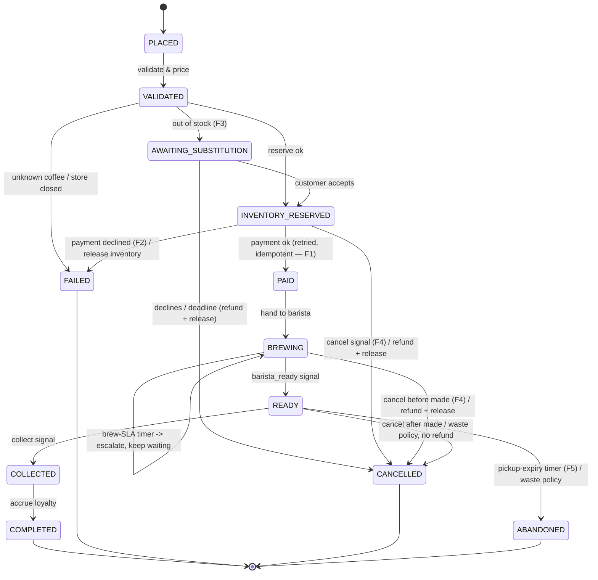

# Order workflow — state diagram

**Signals** (external events): `cancel`, `barista_ready`, `collect`,
`substitution_response(accept)`.
**Timers**: substitution deadline, brew SLA (escalate), pickup expiry (abandon).
**Query**: `status` returns the current `OrderState` at any time.

Terminal states: `COMPLETED`, `FAILED`, `CANCELLED`, `ABANDONED`.
